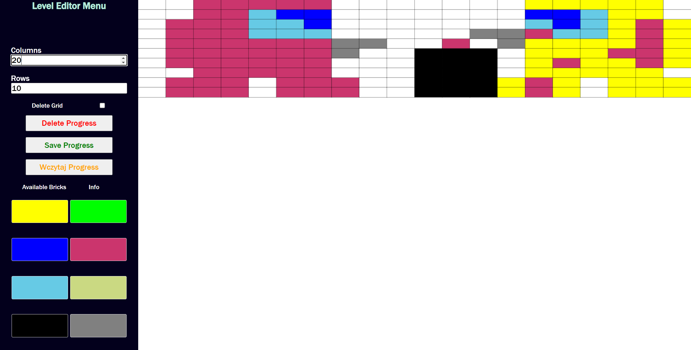

# Level editor

The Arkanoid level editor at your disposal empowers you to craft novel levels while granting you the flexibility to fine-tune the number of rows and columns within them. It is imperative, however, to take note of the fact that modifying the aforementioned parameters triggers an automatic clearance of the canvas, eradicating any preexisting content.

Within this level editor, a diverse palette of eight brick colors is at your disposal, with each hue boasting distinctive properties. This selection allows for the creation of visually captivating and strategically diverse levels.

Should you desire to utilize previously created data, the "load progress" feature, conveniently located in the navigation bar, facilitates the seamless retrieval of such content. It is important to emphasize that only file texts adhering to specific conditions, which deem them valid levels, can be successfully loaded into the editor.

Once a level has been meticulously crafted and you elect to save it, the level is promptly transmitted to the backend of the Arkanoid game. This process ensures instantaneous visibility of your creation, as it manifests itself as a playable level within the game.

While fostering your creative endeavors, it is crucial to bear in mind that the maximum permissible number of rows is restricted to 10, while the column count is limited to 20. Adhering to these boundaries ensures optimal gameplay and level design.

Presented below is a map inspired by the widely popular "Amogus" game, serving as an illustrative example of the possibilities that await:



## Brick Types

| Color       | Times to Hit  | Points | Buff Drop Rate |
| ----------- | ------------- | ------ | -------------- |
| Yellow      | 2             | 20     | 0.1            |
| Green       | 1             | 10     | 0.1            |
| Blue        | 1             | 10     | 0.02           |
| Red         | 1             | 50     | 0.02           |
| Light Blue  | 1             | 10     | 0.02           |
| Light Green | 1             | 10     | 0.05           |
| Black       | 4             | 50     | 0.05           |
| Gray        | 1,000,000,000 | 0      | 0.05           |

Please refer to the following code snippet for the brick data:

```typescript
import { BrickData } from "../interfaces/Level";

export const bricksData = (): BrickData[] => {
  return [
    {
      color: "#ffff00",
      timesToHit: 2,
      points: 20,
      buffDropRate: 0.1,
    },
    {
      color: "#00ff00",
      timesToHit: 1,
      points: 10,
      buffDropRate: 0.1,
    },
    {
      color: "#0000ff",
      timesToHit: 1,
      points: 10,
      buffDropRate: 0.02,
    },
    {
      color: "#cb356d",
      timesToHit: 1,
      points: 50,
      buffDropRate: 0.02,
    },
    {
      color: "#66cae5",
      timesToHit: 1,
      points: 10,
      buffDropRate: 0.02,
    },
    {
      color: "#CAD982",
      timesToHit: 1,
      points: 10,
      buffDropRate: 0.05,
    },
    {
      color: "#000",
      timesToHit: 4,
      points: 50,
      buffDropRate: 0.05,
    },
    {
      color: "#808080",
      timesToHit: 1000000000,
      points: 0,
      buffDropRate: 0.05,
    },
  ];
};
```
